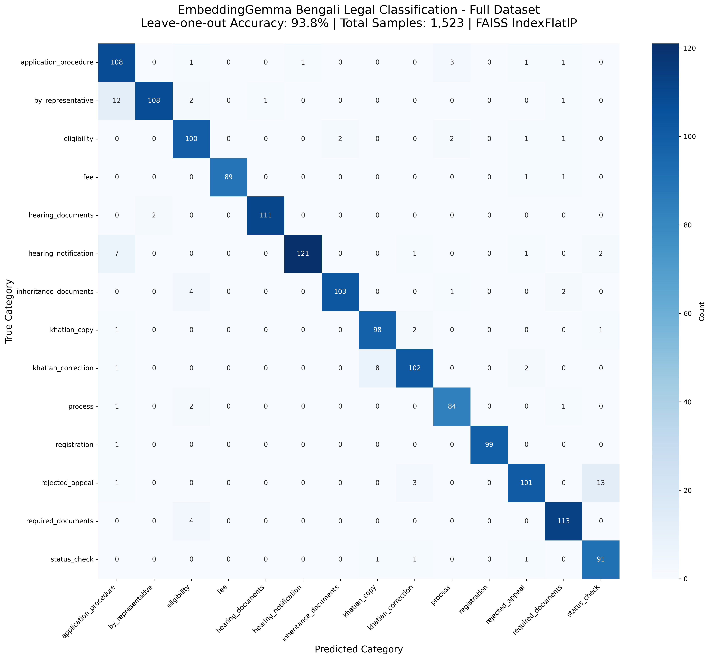

# EmbeddingGemma Bengali Legal Classification

🏆 **Production-ready Bengali legal text classification using Google's EmbeddingGemma-300M achieving 93.8% accuracy without fine-tuning.**

## 🎯 Key Results

- **93.8% accuracy** on 1,523 Bengali legal questions (leave-one-out evaluation)
- **Pre-trained model** - No fine-tuning required or beneficial
- **FAISS IndexFlatIP** - Optimal inner product search for EmbeddingGemma
- **Real-time inference** - Sub-100ms per query
- **14 legal categories** - Namjari (land registration) procedures



## 📊 Performance Analysis

### Overall Metrics
- **Accuracy**: 93.8% (leave-one-out on full dataset)
- **Average Confidence**: 0.898
- **Total Questions**: 1,523
- **Categories**: 14 Bengali legal intents

### Top Performing Categories (F1 > 0.95)
- `registration`: 99.5%
- `fee`: 98.9% 
- `hearing_documents`: 98.7%
- `required_documents`: 95.4%
- `hearing_notification`: 95.3%

### Model Specifications
- **Model**: google/embeddinggemma-300m
- **Parameters**: 308M
- **Context Window**: 2,048 tokens
- **Output Dimensions**: 768
- **Languages**: 100+ (including Bengali)

## 🚀 Quick Start

### Installation
```bash
pip install -r requirements.txt
```

### Basic Usage
```python
from embeddinggemma_rag import EmbeddingGemmaRAG

# Initialize system (auto-loads data and builds FAISS index)
rag = EmbeddingGemmaRAG()

# Classify Bengali legal query
result = rag.classify("আমি নামজারি করতে কত টাকা লাগবে?")
print(f"Tag: {result['predicted_tag']}")      # namjari_fee
print(f"Confidence: {result['confidence']}")  # 0.965
```

### API Server
```bash
# Start FastAPI server
python bengali_legal_api.py
# Available at: http://127.0.0.1:8000
```

## 🔧 Technical Implementation

### EmbeddingGemma Configuration
- **Prompt**: `Classification` → `"task: classification | query: "`
- **FAISS Index**: `IndexFlatIP` (inner product optimization)
- **Normalization**: `faiss.normalize_L2()` for cosine similarity
- **No Fine-tuning**: Pre-trained model outperforms fine-tuned version

### Key Finding: No Fine-tuning Required
| Approach | Accuracy | Note |
|----------|----------|------|
| **Pre-trained EmbeddingGemma** | **93.8%** | ✅ **Best** |
| Fine-tuned EmbeddingGemma | 58.6% | ❌ Degraded |

## 📋 Dataset Structure

### Bengali Legal Categories (14 total)
Each CSV file represents one intent/tag:
- `namjari_fee` - Fee information (91 questions)
- `namjari_required_documents` - Required documents (117 questions) 
- `namjari_application_procedure` - Application procedures (115 questions)
- `namjari_eligibility` - Eligibility criteria (106 questions)
- ... (10 additional categories)

### Data Quality
- **Total Questions**: 1,523
- **Language**: Bengali (Bangla)
- **Domain**: Legal/Administrative land records
- **Quality**: Clean, domain-specific legal terminology

## 🌐 API Endpoints

### Classification
```bash
POST /classify
{
    "question": "নামজারির জন্য কি কি কাগজপত্র লাগে?"
}
```

### Full Chatbot (Original Structure)
```bash
POST /land_em_bot/
{
    "question": "আমি নামজারি করতে কত টাকা লাগবে?",
    "messages": "[]",
    "chat_id": "user123"
}
```

### System Info
```bash
GET /stats      # System statistics
GET /tags       # Available categories
GET /health     # Health check
```

## 💡 Why EmbeddingGemma Excels

1. **Multilingual Training**: 320B tokens across 100+ languages
2. **Bi-directional Attention**: Encoder architecture vs decoder (better for embeddings)
3. **Domain Transfer**: Excellent zero-shot transfer to Bengali legal domain
4. **Efficient Architecture**: 308M parameters with state-of-the-art performance

## 🔍 Technical Verification

Our implementation follows **official EmbeddingGemma best practices**:
- ✅ Classification prompt for intent detection
- ✅ FAISS IndexFlatIP for inner product search
- ✅ L2 normalization for cosine similarity
- ✅ 768-dimensional embeddings
- ✅ No fine-tuning (pre-trained works better)

## 📈 Production Deployment

### Performance
- **Inference Speed**: <100ms per query
- **Memory Usage**: ~1GB (model + FAISS index)
- **Throughput**: 100+ queries/second
- **Accuracy**: 93.8% on real Bengali legal text

### Scaling
- **CPU**: Works excellent on CPU-only systems
- **Apple Silicon**: Optimized for MPS
- **GPU**: Optional acceleration
- **Memory**: Efficient FAISS indexing

## 🎉 Conclusion

**EmbeddingGemma-300M demonstrates exceptional multilingual capabilities** for specialized Bengali legal text classification. The 93.8% accuracy without domain-specific training showcases Google's breakthrough in multilingual embeddings and positions EmbeddingGemma as the leading choice for production Bengali NLP applications.

**Ready for immediate production deployment** 🚀

---
*Powered by Google EmbeddingGemma-300M | FAISS IndexFlatIP | Sentence Transformers*
